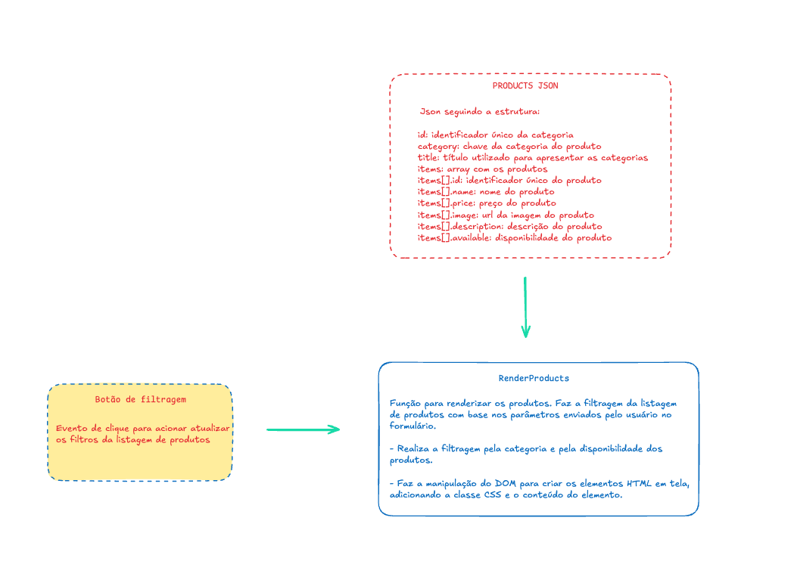

# Apple Store – Filtro de Produtos

Este projeto é uma simulação de uma loja Apple feita em HTML, CSS e JavaScript. Ele permite filtrar e visualizar produtos de diferentes categorias como Mac, iPhone, iPad, Apple Watch, AirPods e acessórios.

---

## Estrutura dos dados

Os produtos são organizados por categoria, onde cada categoria possui um `id`, `category`, `title` e um array de `items`. Cada item contém:

- `id`
- `name`
- `price`
- `image`
- `description`
- `available` (booleano)

Exemplo:

```js
{
  id: "mac",
  category: "mac",
  title: "Mac",
  items: [
    {
      id: "1",
      name: "Macbook Air 15",
      price: 10000,
      image: "...",
      description: "...",
      available: false
    },
    ...
  ]
}
```


## Funcionalidades

- Listagem de produtos por categoria
- Filtro por categoria via `<select>`
- Filtro por disponibilidade com checkbox "Somente disponíveis"
- Exibição dinâmica dos produtos com JavaScript
- Tag **"Esgotado"** para produtos indisponíveis

---

## Lógica de funcionamento

### Eventos

- `click` no botão **"Filtrar"**
- `checked` no checkbox de disponibilidade (avaliado no momento do filtro)

### Funções principais

#### `renderProducts()`
- Limpa o conteúdo anterior
- Ordena os grupos por categoria
- Filtra os dados com base na seleção e checkbox
- Cria dinamicamente os cards dos produtos

#### `button.addEventListener("click")`
- Executa `renderProducts()`

### Diagrama do fluxo




## 👥 Integrantes
- **Bruno Alves**
